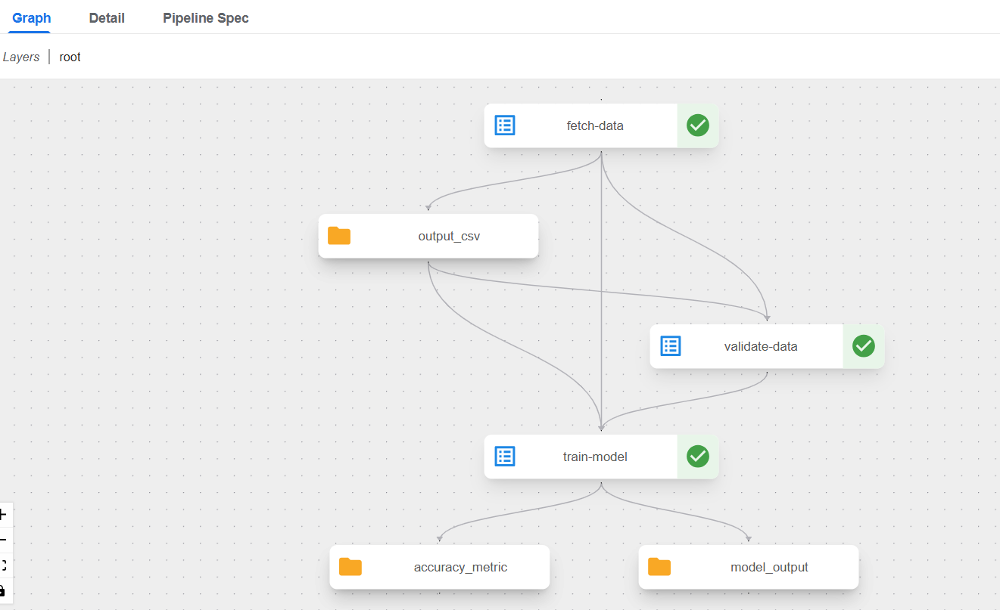

# Iris MLOps Pipeline on Kubernetes (Kubeflow Pipelines)

An end-to-end machine learning pipeline that fetches data, validates it, trains a model, and serves predictions over a REST API — all orchestrated on Kubernetes using Kubeflow Pipelines.

This project is split into two independent layers that work together: a **Model Creation layer** (training) and a **Model Consumption layer** (serving predictions). Understanding why they're separate is the core idea of this whole project.

---

## The big picture 

Think of this project like a small factory with two different departments:

- **The Training Department** (Kubeflow Pipelines) — its only job is to produce a trained model. It runs a sequence of steps — fetch data, check the data is good, train the model — and then it's done. It doesn't run all the time; it runs on demand, like a batch job, and shuts down once finished.
- **The Serving Department** (the FastAPI deployment) — its job is to take a trained model and answer questions about it, live, 24/7. Someone sends it a flower's measurements, it responds instantly with a prediction. Unlike the training department, this one stays running continuously, always ready to respond.

These two departments don't talk to each other in real time. The training department produces a "model file" — like a finished product — and the serving department is loaded up with that file to do its job. They're connected by an artifact (the model file), not by a live conversation.

---

## Architecture diagram

```
                         MODEL CREATION LAYER (Kubeflow Pipelines)
                         ─────────────────────────────────────────
                         Runs on-demand. Each step is its own
                         short-lived container (Pod) on Kubernetes.

        ┌──────────┐        ┌──────────────┐        ┌─────────────┐
        │  Fetch   │  --->  │   Validate   │  --->  │    Train    │
        │   Data   │        │     Data     │        │    Model    │
        └──────────┘        └──────────────┘        └─────────────┘
        (downloads          (checks schema,          (trains a
        Iris dataset,        nulls, ranges;           RandomForest
        saves as CSV)        stops pipeline           classifier,
                              if data is bad)          saves model
                                                        + accuracy)
                                                              |
                                                              | model.joblib
                                                              v
                         ───────────────────────────────────────────
                         MODEL CONSUMPTION LAYER (Kubernetes Deployment)
                         ───────────────────────────────────────────
                         Runs continuously. One long-lived Pod,
                         always on, always ready to answer requests.

                              ┌───────────────────────────┐
                              │   FastAPI Prediction API   │
                              │   (iris-classifier Pod)    │
                              │                             │
                              │   POST /predict  ────────► returns
                              │   GET  /health    ────────► species
                              └───────────────────────────┘
                                          ▲
                                          │  HTTP request
                                          │
                                  (you / any client)
```

**Key distinction:** the top half (training) is made of **short-lived Pods** that run once and exit. The bottom half (serving) is **one long-lived Pod** that never stops. This is a deliberate, realistic split — in real companies, the team that trains models and the team that serves them are often different, with a model file (or a model registry) as the handoff point between them.

---

## What each part actually does

### 1. Fetch Data
Downloads the classic Iris flower dataset (150 flower measurements, 3 species) and saves it as a CSV. Runs inside its own container, managed by Kubeflow Pipelines.

### 2. Validate Data
Reads the CSV and runs a set of quality checks:
- Are all the expected columns present?
- Are there at least 50 rows (i.e., did the fetch actually work)?
- Are there any missing/null values?
- Are the measurements within a sane physical range (no negative or absurd values)?
- Are the species labels valid (only 3 expected classes)?

If **any** check fails, this step exits with an error — and Kubernetes will **not** run the training step. Bad data never reaches the model. This is the "quality gate" of the pipeline.

### 3. Train Model
Trains a `RandomForestClassifier` on the validated data, evaluates it on a held-out test set, and saves:
- The trained model file (`model.joblib`)
- Accuracy and F1 score, logged as structured metrics visible in the Kubeflow UI

### 4. Deploy / Serve (Model Consumption)
The trained model is packaged into a small web service (built with FastAPI) and deployed as a standing Kubernetes Deployment + Service. It exposes:
- `GET /health` — used by Kubernetes itself to check the service is alive (and automatically restart it if not)
- `POST /predict` — accepts flower measurements, returns the predicted species and confidence scores

---

## Tools used and why

| Tool | What it's for | Why this one |
|---|---|---|
| **Kind** (Kubernetes in Docker) | Runs a real Kubernetes cluster locally, as Docker containers | Free, lightweight, no cloud account needed |
| **Kubeflow Pipelines** | Orchestrates the fetch → validate → train sequence as a DAG | Purpose-built for ML workflows, runs natively on Kubernetes |
| **scikit-learn** | The ML library used to train the model | Simple, well-known, fast to train |
| **FastAPI** | Serves the trained model over a REST API | Lightweight, fast, automatic request validation |
| **Docker** | Packages the prediction service into a portable container | Required for anything to run on Kubernetes |
| **GitHub Codespaces** | Cloud development environment used to build/run this project | Free tier available, no local machine setup needed |

---
Kubeflow Diagram


---

## How to run this yourself

### Prerequisites
- A GitHub account (for Codespaces) — or Docker + Kind installed locally
- Basic familiarity with a terminal

### 1. Set up the cluster

```bash
kind create cluster --name mlops-pipeline
kubectl get nodes   # should show one node, STATUS = Ready
```

### 2. Install Kubeflow Pipelines (standalone)

```bash
export PIPELINE_VERSION=2.16.1
kubectl apply -k "github.com/kubeflow/pipelines/manifests/kustomize/cluster-scoped-resources?ref=$PIPELINE_VERSION"
kubectl wait --for condition=established --timeout=60s crd/applications.app.k8s.io
kubectl apply -k "github.com/kubeflow/pipelines/manifests/kustomize/env/platform-agnostic?ref=$PIPELINE_VERSION"

# Wait until all pods are Running:
kubectl get pods -n kubeflow -w
```

### 3. Open the Kubeflow Pipelines UI

```bash
kubectl port-forward -n kubeflow svc/ml-pipeline-ui 8080:80
```
Open the forwarded port `8080` in your browser.

### 4. Compile and upload the training pipeline

```bash
pip install kfp pandas scikit-learn joblib --break-system-packages
python pipeline.py        # produces iris_pipeline.yaml
```
Upload `iris_pipeline.yaml` in the Kubeflow UI ("+ Upload pipeline"), then click **+ Create run** to execute the fetch → validate → train DAG.

### 5. Build and deploy the prediction service

```bash
docker build -t iris-classifier:v1 .
kind load docker-image iris-classifier:v1 --name mlops-pipeline
kubectl apply -f deployment.yaml
kubectl get pods -l app=iris-classifier   # wait for 1/1 Running
```

### 6. Call the prediction API

```bash
kubectl port-forward svc/iris-classifier-service 8001:80

curl -X POST http://localhost:8001/predict \
  -H "Content-Type: application/json" \
  -d '{"sepal_length": 5.1, "sepal_width": 3.5, "petal_length": 1.4, "petal_width": 0.2}'
```

Expected response:
```json
{"predicted_class":0,"predicted_species":"setosa","probabilities":[1.0,0.0,0.0]}
```

---

## Project structure

```
.
├── fetch_data.py        # Stage 1: standalone script (for local testing)
├── validate_data.py     # Stage 2: standalone script (for local testing)
├── train_model.py       # Stage 3: standalone script (for local testing)
├── pipeline.py           # KFP pipeline definition (wires stages 1-3 into a DAG)
├── iris_pipeline.yaml    # Compiled pipeline, uploaded to Kubeflow UI
├── app.py                 # FastAPI prediction service (stage 4)
├── Dockerfile             # Containerizes the FastAPI service
├── deployment.yaml        # Kubernetes Deployment + Service for serving
├── requirements.txt       # Python dependencies for the serving container
└── README.md
```

---

## Known limitations / what a production version would add

This project intentionally keeps a few things simple to stay focused on demonstrating Kubernetes/Kubeflow orchestration skills rather than building a full production system:

- **No automatic handoff between training and serving.** Right now, a newly trained model isn't automatically picked up by the serving Pod — in production this would go through a model registry (e.g., MLflow Model Registry) with the serving layer pulling the latest approved model automatically.
- **Data source is a built-in dataset, not a live external source.** This removes network/API flakiness as a point of failure, keeping the focus on the pipeline mechanics rather than data engineering.
- **Single replica serving deployment.** A production setup would run multiple replicas behind the Service for high availability and load distribution.

---

## What this project demonstrates

- Setting up and operating a local Kubernetes cluster
- Installing and configuring Kubeflow Pipelines on Kubernetes
- Writing a multi-stage ML pipeline as a Kubernetes-native DAG (using the KFP Python SDK)
- Implementing a real data-quality gate that halts a pipeline on bad data
- Containerizing a Python ML service with Docker
- Deploying a model as a REST API on Kubernetes, with health/readiness probes for self-healing
- Understanding the architectural separation between batch training workflows and real-time serving workloads
